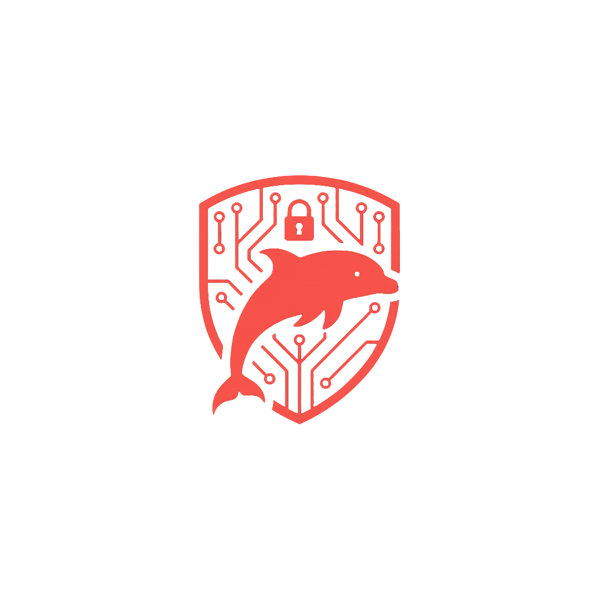

  

<h1 align="center">LEVIATHAN</h1>

  <b>Complete Penetration Testing Suite for Kali Linux</b>

  <strong>Author:</strong> <a href="https://codeberg.org/funbinet">funbinet</a> • <strong>GitHub:</strong> <a href="https://github.com/funbinet">github.com/funbinet</a> • <strong>License:</strong> Proprietary

  

---

## Overview

**LEVIATHAN** is a modern, feature-rich GUI orchestrator for penetration testing tools on Kali Linux. Built with Python and PyQt6, it provides a unified interface that follows the **Penetration Testing Execution Standard (PTES)** methodology, allowing security professionals to conduct comprehensive assessments through an intuitive graphical interface.

The suite transforms complex penetration testing workflows into a streamlined, unified experience, eliminating the need to manage multiple disparate tools and interfaces. LEVIATHAN orchestrates the entire offensive security lifecycle from reconnaissance to post-exploitation.

---

## Core Purpose

LEVIATHAN addresses the fundamental challenges in modern penetration testing:

- **Tool Fragmentation**: Security testers waste time switching between different tools and interfaces
- **Complex Workflows**: Manual coordination of multiple security tools leads to inefficiencies
- **Skill Gaps**: Not all team members are experts in every security tool
- **Response Time**: Slow testing processes due to tool switching and manual processes
- **Reporting Complexity**: Difficulty in generating comprehensive penetration testing reports

LEVIATHAN solves these problems by providing a single, integrated platform that handles the entire penetration testing workflow.

---

## Architecture & Design

### Unified Interface
- **Single Application**: One GUI for all 100+ security tools
- **Consistent Experience**: Uniform interface across all testing operations
- **Theme Support**: Multiple visual themes for different environments
- **Session Management**: Save and resume penetration testing assessments

### High-Performance Execution
- **Parallel Processing**: Run multiple tools simultaneously
- **Async Architecture**: Non-blocking operations for responsive UI
- **Real-time Output**: Live streaming of tool results
- **Resource Optimization**: Efficient use of system resources

### Intelligent Automation
- **Smart Tool Selection**: Automatic tool recommendations based on context
- **Workflow Orchestration**: Automated progression through testing phases
- **Output Parsing**: Structured data extraction from tool outputs
- **Report Generation**: Automated penetration testing report creation

---

## Penetration Testing Phases

LEVIATHAN organizes offensive operations into 12 comprehensive phases following the PTES methodology:

### 1. Discovery (Network Asset Discovery)
**Purpose**: Find live hosts on the network before detailed scanning.

**Capabilities**:
- Network host discovery and enumeration
- Active/passive ARP reconnaissance
- ICMP and TCP ping sweeps
- Large-scale network mapping
- Device fingerprinting and identification

**Tools**: Nmap, ARP Scan, Netdiscover, Masscan, Fping

### 2. Reconnaissance (Information Gathering)
**Purpose**: Gather intelligence about targets without direct interaction.

**Capabilities**:
- Subdomain enumeration and DNS analysis
- Email and username harvesting
- Web technology fingerprinting
- Social media reconnaissance
- OSINT automation and correlation

**Tools**: Amass, theHarvester, WhatWeb, Sherlock, SpiderFoot

### 3. Scanning (Port and Service Analysis)
**Purpose**: Deep port scanning and service enumeration.

**Capabilities**:
- Comprehensive port scanning
- Service version detection
- Operating system fingerprinting
- Packet crafting and analysis
- Internet-scale scanning capabilities

**Tools**: Nmap, Masscan, RustScan, Hping3, ZMap

### 4. Enumeration (Service and Directory Analysis)
**Purpose**: Detailed enumeration of discovered services and directories.

**Capabilities**:
- Directory and file brute-forcing
- Web application fuzzing
- SMB/NetBIOS enumeration
- SNMP service analysis
- DNS zone enumeration

**Tools**: Gobuster, FFUF, Enum4linux-ng, SNMP-Check, DNSRecon

### 5. Vulnerability Assessment (Security Weakness Identification)
**Purpose**: Identify security vulnerabilities and weaknesses.

**Capabilities**:
- Template-based vulnerability scanning
- Web server security analysis
- Exploit database integration
- WordPress vulnerability assessment
- SSL/TLS configuration analysis

**Tools**: Nuclei, Nikto, Searchsploit, WPScan, SSLScan

### 6. Exploitation (Active Vulnerability Exploitation)
**Purpose**: Exploit identified vulnerabilities to gain access.

**Capabilities**:
- Exploitation framework integration
- SQL injection automation
- Command injection testing
- Browser exploitation frameworks
- Dynamic instrumentation tools

**Tools**: Metasploit, SQLMap, Commix, BeEF, Frida

### 7. Phishing (Social Engineering Attacks)
**Purpose**: Create and execute sophisticated phishing campaigns.

**Capabilities**:
- Email template creation with tracking
- Weaponized payload generation
- HTTP/HTTPS listener hosting
- Campaign orchestration and management
- SMTP spoofing and delivery tracking

**Tools**: Custom phishing framework with 19 integrated tools

### 8. Wireless Security Testing (WiFi Assessment)
**Purpose**: Test wireless network security and protocols.

**Capabilities**:
- Monitor mode management
- Packet capture and analysis
- Deauthentication attacks
- WEP/WPA cracking
- Automated wireless auditing
- WPS attack vectors
- Evil twin and rogue AP detection

**Tools**: Aircrack-ng, Aireplay-ng, Airodump-ng, Wifite, Reaver, Bully

### 9. Bluetooth Security Testing (BT Assessment)
**Purpose**: Test Bluetooth device and protocol security.

**Capabilities**:
- Bluetooth device discovery
- Address spoofing and impersonation
- Proximity detection and tracking
- Hidden device discovery
- Protocol analysis and exploitation

**Tools**: hcitool, btscanner, Spooftooph, Redfang, BlueRanger

### 10. USB Security Testing (Hardware Attacks)
**Purpose**: Test USB device security and BadUSB attacks.

**Capabilities**:
- USB device enumeration
- Rubber Ducky simulation
- BadUSB payload creation
- USB traffic analysis
- Device spoofing and impersonation

**Tools**: Custom USB testing framework

### 11. Password Cracking (Authentication Testing)
**Purpose**: Test password strength and cracking resistance.

**Capabilities**:
- Dictionary and brute-force attacks
- Hash cracking and analysis
- Online password testing
- Parallel password processing
- GPU-accelerated cracking

**Tools**: John the Ripper, Hashcat, Hydra, Medusa, Ncrack

### 12. Post-Exploitation (Privilege Escalation & Persistence)
**Purpose**: Maintain access and escalate privileges after initial compromise.

**Capabilities**:
- Linux privilege escalation
- Windows privilege escalation
- Credential extraction and analysis
- Network protocol exploitation
- WinRM shell management

**Tools**: LinPEAS, WinPEAS, Mimikatz, Impacket, Evil-WinRM

### 13. Digital Forensics (Evidence Collection & Analysis)
**Purpose**: Collect and analyze evidence during penetration testing.

**Capabilities**:
- Memory forensics and analysis
- Firmware reverse engineering
- File carving and recovery
- Digital forensics platform integration
- Network traffic forensics

**Tools**: Volatility 3, Autopsy, The Sleuth Kit, Binwalk, Foremost

---

## Key Features

### Advanced GUI
- **Modern Interface**: Clean, professional design with multiple themes
- **Tabbed Organization**: Logical grouping by testing phases
- **Real-time Monitoring**: Live progress indicators and status updates
- **Screenshot Capability**: Built-in screen capture for documentation

### Performance & Scalability
- **Parallel Execution**: Run multiple tools simultaneously
- **Batch Processing**: Queue operations for multiple targets
- **Resource Management**: Efficient CPU and memory utilization
- **Background Processing**: Non-blocking operations for responsive UI

### Intelligence & Automation
- **Smart Recommendations**: Context-aware tool suggestions
- **Automated Workflows**: Guided progression through testing phases
- **Output Intelligence**: Structured data extraction and correlation
- **Report Automation**: Comprehensive penetration testing report generation

### Wireless & Bluetooth Integration
- **WiFi Management**: Complete wireless testing suite integration
- **Bluetooth Tools**: Comprehensive Bluetooth security assessment
- **Monitor Mode**: Full support for wireless monitoring and injection
- **Device Discovery**: Automated device enumeration and analysis

---

## Applications & Use Cases

### Professional Penetration Testing
- **Enterprise Assessments**: Comprehensive security testing for organizations
- **Red Team Operations**: Simulated adversary attacks and techniques
- **Compliance Testing**: Security audits and regulatory compliance
- **Vulnerability Assessments**: Systematic weakness identification

### Security Research & Education
- **Research Projects**: Security research and tool development
- **Training Platforms**: Hands-on cybersecurity education
- **Red Team Training**: Offensive security skills development
- **CTF Competitions**: Capture the Flag event preparation

### Consulting & Services
- **Security Consulting**: Professional penetration testing services
- **Incident Simulation**: Breach simulation and response testing
- **Security Audits**: Comprehensive security assessment services
- **Tool Development**: Custom security tool creation and testing

### Government & Military
- **Government Networks**: Secure government system testing
- **Military Applications**: Military network security assessment
- **Critical Infrastructure**: Essential service security testing
- **Intelligence Operations**: Secure data handling and analysis

---

## Technical Specifications

### System Requirements
- **Operating System**: Kali Linux (primary), Ubuntu/Debian (secondary)
- **Python Version**: 3.10 or higher
- **Memory**: 4GB RAM minimum, 8GB recommended
- **Storage**: 20GB free space for tools and data
- **Display**: 1920x1080 resolution minimum

### Supported Platforms
- **Primary**: Kali Linux distributions
- **Secondary**: Ubuntu, Debian, and other Linux distributions
- **Wireless**: Full wireless testing capabilities
- **Bluetooth**: Complete Bluetooth assessment support

### Dependencies
- **Core Framework**: PyQt6 for GUI, asyncio for concurrency
- **Security Tools**: 100+ integrated penetration testing tools
- **Data Processing**: XML, JSON, and text parsing libraries
- **Wireless Support**: Native wireless interface management

---

## Security & Compliance

### Testing Standards
- **PTES Compliance**: Complete Penetration Testing Execution Standard coverage
- **OSSTMM Alignment**: Open Source Security Testing Methodology
- **NIST Framework**: National Institute of Standards and Technology guidelines
- **OWASP Standards**: Open Web Application Security Project methodologies

### Ethical Testing
- **Authorization Required**: All testing requires explicit written permission
- **Scope Adherence**: Strict adherence to agreed testing boundaries
- **Data Protection**: Secure handling of discovered sensitive information
- **Responsible Disclosure**: Proper vulnerability disclosure procedures

---

## Author Information

**funbinet** is a cybersecurity specialist and penetration tester currently pursuing a Computer Science degree at Chuka University. With expertise in red teaming, penetration testing, and offensive security, funbinet develops comprehensive security solutions that advance the field of ethical hacking.

### Background
- **Education**: Computer Science student at Chuka University
- **Specialization**: Penetration Testing, Red Teaming, Offensive Security
- **Experience**: Developing security testing frameworks and tools
- **Philosophy**: "Understanding systems like an attacker, securing them like an engineer"

### Projects
- **LEVIATHAN**: Complete penetration testing suite
- **OMNISEC**: Comprehensive defensive security platform
- **Various Security Tools**: Custom security automation and analysis tools

### Contact
- **Email**: funbinet@gmail.com
- **Codeberg**: https://codeberg.org/funbinet
- **GitHub**: https://github.com/funbinet

---

## License

### Proprietary Software License

Copyright (c) 2024 funbinet

All rights reserved.

This software is the property of funbinet and is protected by copyright laws and international copyright treaties. No part of this software may be reproduced, distributed, or transmitted in any form or by any means, including photocopying, recording, or other electronic or mechanical methods, without the prior written permission of funbinet, except in the case of brief quotations embodied in critical reviews and certain other noncommercial uses permitted by copyright law.

### Restrictions:

1. **No Redistribution**: You may not redistribute this software, in whole or in part, to any third party.
2. **No Modification**: You may not modify, adapt, translate, reverse engineer, decompile, or disassemble this software.
3. **No Commercial Use**: You may not use this software for commercial purposes, including but not limited to selling, renting, licensing, or distributing the software for a fee.
4. **No Transfer**: You may not transfer, lease, or sublicense this software to any other party.

### Limited License:

A limited, non-exclusive, non-transferable license is granted to the original licensee for personal, non-commercial use only. This license is subject to all terms and conditions of this agreement.

### Disclaimer:

This software is provided "as is" without warranty of any kind, express or implied. funbinet shall not be liable for any damages arising from the use of this software.

### Termination:

This license will terminate automatically if you violate any of these terms and conditions. Upon termination, you must immediately cease all use of the software and destroy all copies in your possession or control.

### Source Code Access

The source code for LEVIATHAN is proprietary and not publicly available. If you are interested in accessing the source code for research, educational, or legitimate security purposes, please contact the author directly at funbinet@gmail.com to discuss licensing and access arrangements.

---

## Getting Started

LEVIATHAN is designed for authorized security professionals and penetration testers. To obtain access to the software:

1. **Review Requirements**: Ensure your system meets the technical specifications
2. **Contact Author**: Email funbinet@gmail.com with your use case and requirements
3. **License Agreement**: Discuss licensing terms and access arrangements
4. **Installation**: Receive installation instructions and support
5. **Training**: Optional training and documentation provided

---

  <b>LEVIATHAN</b> — Complete Penetration Testing Suite
   
  <small>© 2025 funbinet • Proprietary Software • All Rights Reserved</small>

